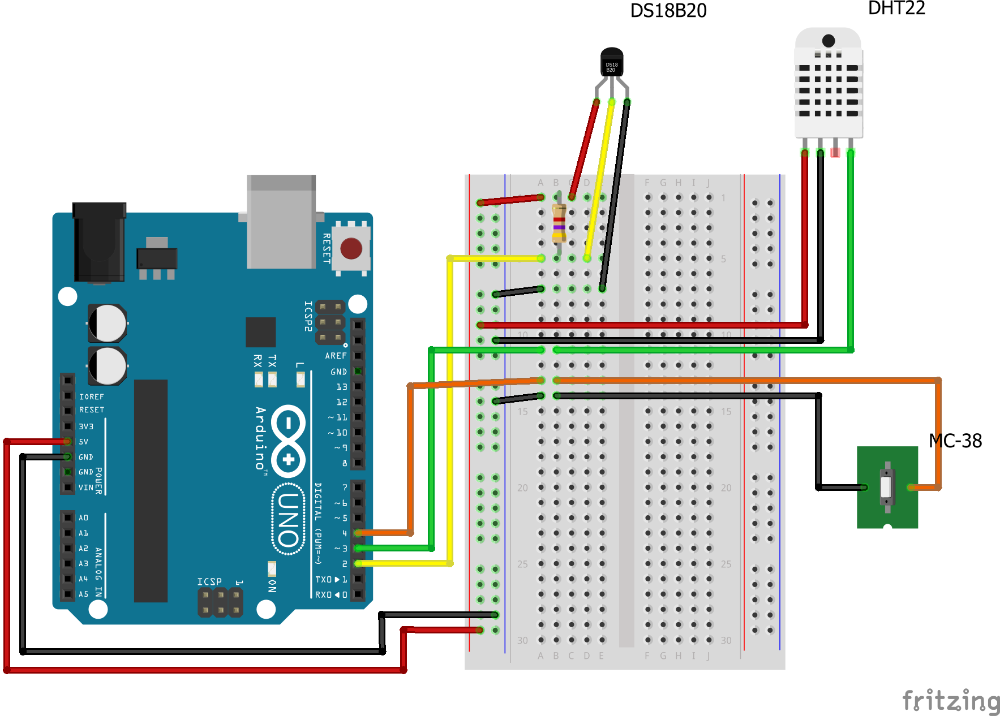

# Arduino (Sensor Data Collection)
An Arduino Micro running the included code, while connected to a variety of sensors, and transmitting the data elsewhere to be processed.

## enviro-duino.ino
This is the main code that is uploaded to the Ardduino mounted in the server closet. This is intended to be just smart enough to get the data from all the connected sensors, and transmit the data with a label, over the serial bus. 

Ideally, new sensors should be able to be added (of the same types) without needing to modify the running code, or restarting the Arduino.

## Trials (directory)
This directory includes simple files that were/are used to explore the libraries and sensors functionality before adding it to the main code

## Sensors
This is the current list of connected sensors with links where I purchased them. 
> None of these are affiliate, or tracking links!
- Arduino Micro
  - [Arduino](https://store.arduino.cc/arduino-micro)
  - [Amazon](https://www.amazon.com/gp/product/B00AFY2S56/)
- DS18B20 Water-Proof Temperature Sensor
  - [Adafruit](https://www.adafruit.com/product/381)
  - [Amazon](https://www.amazon.com/gp/product/B012C597T0/)
- DHT22 Temperature and Humidity Sensor
  - [Adafruit](https://www.adafruit.com/product/385)
  - [Amazon](https://www.amazon.com/gp/product/B07XBVR532/)
- MC-38 Magnetic Switch
  - [Adafruit](https://www.adafruit.com/product/375)
  - [Amazon](https://www.amazon.com/gp/product/B0154PTDFI/)